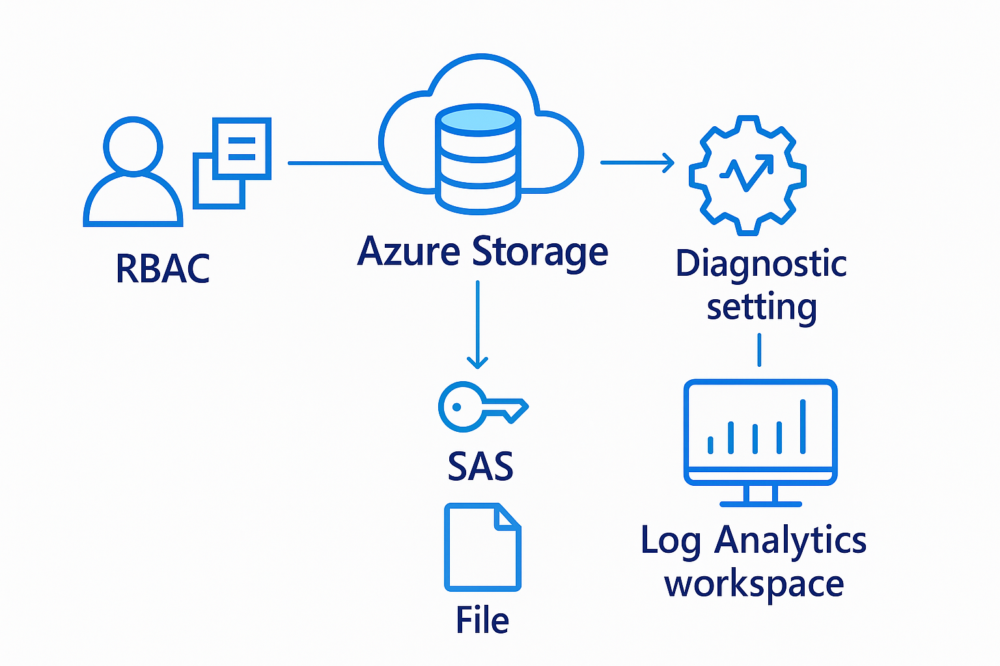

## Azure Secure Storage with RBAC and SAS Tokens Lab

Securing Azure Storage Accounts using RBAC, SAS tokens and Log Analytics. 

---

## Table of Contents

- [Overview](#overview)
- [Real-World Risk](#real-world-risk)
- [What I Built](#what-i-built)
- [Diagram](#diagram)
- [Objectives](#objectives)
- [Steps Performed](#steps-performed)
  - [1. Resource Group Setup]  
  - [2. Storage Account Deployment]  
  - [3. RBAC Role Assignment] 
  - [4. Blob Container and Data Upload]  
  - [5. SAS Token Generation and Testing] 
  - [6. Diagnostic Settings: Metrics and Limitations]  
  - [7. Log Analytics Workspace Setup and Querying]
  - [8. Cleanup]
- [Screenshots](#screenshots)
- [Lessons Learned](#lessons-learned)
- [Notes & Limitations](#notes--limitations)
- [References](#references)
- [Contact](#contact)

---

## Overview

This hands-on lab demonstrates how to secure data in Azure Storage Accounts using Role-Based Access Control (RBAC), Shared Access Signatures (SAS tokens) and monitoring via Log Analytics. The goal: Protect sensitive data in cloud storage by enforcing least privilege, controlling access and monitoring usage—a core skill for cloud security professionals.

---

## Real-World Risk

**Data exfiltration** is a top cloud risk. Misconfigured storage (e.g., public blobs or excessive permissions) can expose sensitive files.  

This lab shows how to:
- Block public/anonymous access.
- Use RBAC for least-privilege assignment.
- Grant scoped, temporary access via SAS.
- Monitor and audit usage.

---

## What I Built

- Created an Azure Storage Account with public access disabled and secure settings enforced.
- Configured RBAC to allow only specific users/roles access to blob data.
- Generated a SAS token to enable limited, time-bound access to a single blob.
- Set up monitoring with Log Analytics, using both the Azure Portal and CLI to handle UI limitations.
- Queried and documented storage activity using Kusto Query Language (KQL)

---

## Diagram

---

## Objectives

- Secure an Azure Storage Account using best practices for access control and monitoring.
- Implement Role-Based Access Control (RBAC) to enforce least-privilege data access.
- Generate and test Shared Access Signatures (SAS) for scoped, temporary blob access.
- Enable diagnostic settings for storage monitoring and auditability.
- Use Log Analytics and KQL queries to visualize and monitor storage account activity.
- Document real-world platform limitations and demonstrate troubleshooting skills using the Azure CLI.

---

## Steps Performed

**1. Resource Group Setup**  
   - Created a dedicated resource group for the lab (`rg-sec-lab6-jd`)*(Screenshot: `resource_group_create.png`)*

**2. Storage Account Deployment**  
   - Created a secure Azure Storage Account (`stseclab6jd`) with public/anonymous access disabled and secure transfer enabled *(Screenshot: `storage_account_create.png`)*

**3. RBAC Role Assignment**  
   - Assigned the `Storage Blob Data Reader` role to a test user, enforcing least-privilege access to blobs *(Screenshot: `rbac_role_assignment.png`)*

**4. Blob Container and Data Upload**  
   - Created a private blob container (`datacontainer`) to securely store data *(Screenshot: `container_create.png`)*
   - Uploaded a test file to the new container *(Screenshot: `file_uploaded.png`)*

**5. SAS Token Generation and Testing**  
   - Generated a SAS token granting time-limited, read-only access to the blob *(Screenshot: `generate_sas_form.png`)*
   - Tested blob access using the SAS URL in an incognito/private browser window to verify secure access *(Screenshot: `sas_token_test.png`)*

**6. Diagnostic Settings: Metrics and Limitations**  
   - Attempted to enable diagnostic settings for blob activity logs; portal UI only showed metric options (no log categories) *(Screenshot: `diag_setting_no_log_categories.png`)*  
   - Enabled available metrics logging (Transaction, Capacity) via the portal *(Screenshot: `diag_setting_portal_metrics_only.png`)*
   - Used Azure CLI to list supported diagnostic categories, confirming only metrics are available for this storage account type*(Screenshot: `diag_setting_categories_cli.png`)*

**7. Log Analytics Workspace Setup and Querying**  
   - Created and connected a Log Analytics workspace to collect storage metrics *(Screenshot: `log_analytics_create.png`)*
   - Queried storage metrics using KQL to validate monitoring setup and display transaction data for the storage account *(Screenshot: `log_analytics_query_results.png`)*

**8. Cleanup**
   - Delete the resource group (rg-sec-lab6-jd) to remove all resources.
   - Delete any test users/groups created in Azure AD, if not needed.
   - Check Azure Portal for any leftover resources.

---

## Screenshots

*All screenshots are included in the `screenshots/` folder.*

| Step | Filename                               | Description                                                    |
|------|----------------------------------------|----------------------------------------------------------------|
| 1    | resource_group_create.png              | Resource group creation for the lab                            |
| 2    | storage_account_create.png             | Secure storage account setup (private, secure transfer, TLS)   |
| 3    | rbac_role_assignment.png               | RBAC assignment (Storage Blob Data Reader role)                |
| 4    | container_create.png                   | Blob container creation (private access)                       |
| 5    | file_uploaded.png                      | File uploaded to the storage container                         |
| 6    | generate_sas_form.png                  | SAS token generation (scope, permissions, expiry set)          |
| 7    | sas_token_test.png                     | Testing blob access using SAS URL (private/incognito)          |
| 8    | diag_setting_no_log_categories.png     | Diagnostic setting UI limitation (no log categories shown)     |
| 9    | diag_setting_portal_metrics_only.png   | Diagnostic settings in portal (metrics enabled only)           |
| 10   | diag_setting_categories_cli.png        | CLI: supported diagnostic categories for storage account       |
| 11   | log_analytics_create.png               | Log Analytics workspace creation                               |
| 12   | log_analytics_query_results.png        | KQL query & results in Log Analytics (metrics for storage)     |

---

## Lessons Learned

- **RBAC and SAS provide layered access control:** RBAC is best for user/group access, while SAS is ideal for time-limited, delegated access.
- **Diagnostics and monitoring can vary:** Not all storage accounts support granular blob logging; adapting to available metric logging is important.
- **Azure CLI is essential for troubleshooting:** When the portal UI is limited, CLI tools help validate capabilities and settings.
- **KQL and Log Analytics enable real-time monitoring:** Even when only metrics are available, you can gain insights into storage usage patterns and activity.
- **Documentation and evidence are key:** Clear screenshots and explanations help prove security work to auditors, teammates and recruiters.
- **Adaptability is a cloud skill:** Knowing how to document and work around platform limitations is as important as knowing the “ideal” procedure.

---

## Notes & Limitations

- This lab was performed on a storage account that only supported metrics logging.
- In some subscriptions, you may need to create a “General Purpose v2” account in a major region to get full StorageBlobLogs.
- All steps and screenshots were performed by the user and are reproducible for portfolio or interview demos.

---

## References

- [Secure access to data in Azure Storage](https://learn.microsoft.com/en-us/azure/storage/common/storage-security-guide)
- [Azure Storage Account RBAC roles](https://learn.microsoft.com/en-us/azure/storage/common/storage-auth-aad-rbac-portal)
- [Using SAS tokens for Azure Storage](https://learn.microsoft.com/en-us/azure/storage/common/storage-sas-overview)
- [Configure diagnostic settings for Azure resources](https://learn.microsoft.com/en-us/azure/azure-monitor/essentials/diagnostic-settings)
- [Query Azure Monitor data using Log Analytics](https://learn.microsoft.com/en-us/azure/azure-monitor/logs/log-analytics-tutorial)
- [Azure CLI documentation](https://learn.microsoft.com/en-us/cli/azure/reference-index?view=azure-cli-latest)

---

## Contact

Sebastian Silva C. – July, 2025 – Berlin, Germany.  
[LinkedIn](https://www.linkedin.com/in/sebastiansilc) | [GitHub](https://github.com/SebaSilC) | [sebastian@playbookvisualarts.com](mailto:sebastian@playbookvisualarts.com)
